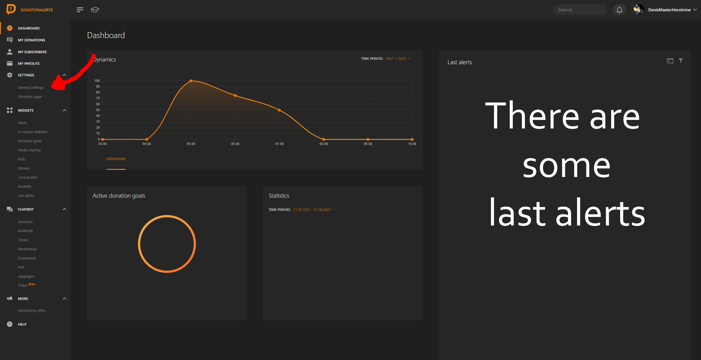
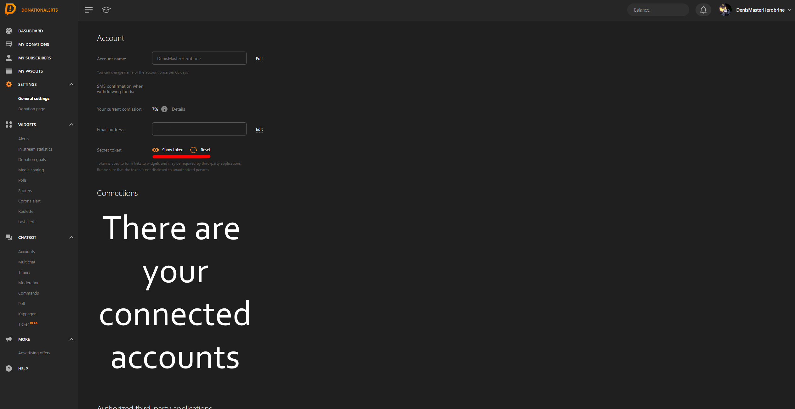

Finding your Donation Alerts Key
================================

| Note: |
|--------|
| Playing Test Events work with CCI, but isn't always representative of a live events. DonationAlerts use a specific marker to send a Socket.IO event and trigger CCI events while testing. You need to place a mark near "Alert donation in widget" string, when adding a test donation in "My Donations" category! |

 
 

1. Go to your [DonationAlerts dashboard](https://www.donationalerts.com/dashboard) and then go through your menu and find "General Settings" link after Settings category.

{: class="img_center"}
 
 
2. Find "Secret token:" and click on "Show token" button. After that you'll get your token mentioning 20 random letters or numbers or whatever you'll see. This token must be seen only to you. 

{: class="img_center"}
 
 
3. After that, go to your game or config file: put it as token for DonationAlerts. That's your DonationAlerts token. If you beware that you entered it somewhere, where it doesn't need - reset it immediately on the same page.

| Notice: |
|--------|
| DonationAlerts uses same socket API key and events for Donations, Twitch Bits and Twitch Channel Points. If you use Twitch Channel Points rewards through DonationAlerts: you need to set "amount" to amount of channel points required to spend to obtain a reward. You have a reward with 10000 channel points? Write into "amount" as 10000 USD or RUB. (whatever currency you use in DonationAlerts). Same is for Bits and Donations. If your event uses 1 RUB, same output will be for 1 Bits too! If 1 USD, then it will be recognized as 1 bits too. Sounds weird, but it's true. |
